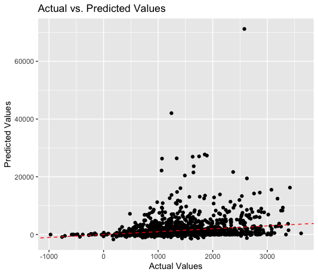
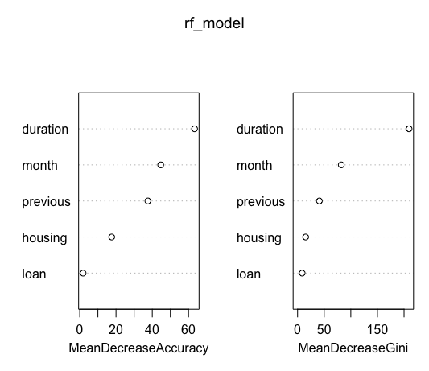
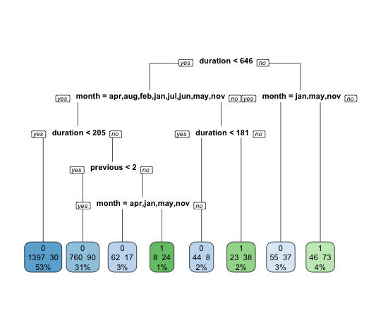
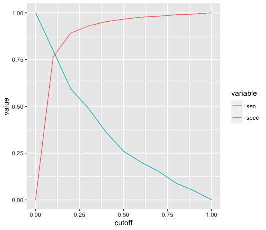

# Bank Marketing Data Analysis Project

## Project Overview
This project analyzes the effectiveness of direct marketing campaigns of a Portuguese banking institution, using detailed data from phone-based campaigns. The objective is to determine factors influencing the success of these campaigns in promoting term deposits among clients.

## Dataset
The dataset includes various attributes such as client age, job type, marital status, education, and previous campaign outcomes. It is publicly available for download in Excel format from the course Blackboard and in CSV format from the [UCI Machine Learning Repository](https://archive.ics.uci.edu/ml/datasets/bank+marketing).

## Features
### Data Cleaning and Preparation
- **Loading Data**: Data is loaded from an Excel file using `read_excel()` from the `readxl` package.
- **Initial Inspection**: Using `str()` to display the structure of the dataset and `sum(is.na(bank_data))` to check for missing values.
- **Renaming Columns**: The column 'y' is renamed to 'term_deposit' to clarify its meaning.
- **Data Conversion**: The 'term_deposit' column values are converted from "yes" and "no" to numeric (1 and 0) using the `as.numeric()` function.

### Exploratory Data Analysis (EDA)
- **Variable Distribution**: Generating histograms and bar charts to explore the distribution and frequency of key variables like age, job, and education.
- **Proportional Analysis**: Calculating and plotting the proportions of clients subscribing to term deposits based on marital status and other demographics.

### Predictive Modeling
- **Creating Dummy Variables**: Utilizing `model.matrix()` to convert categorical variables into a format suitable for modeling.
- **Logistic Regression and Decision Trees**: Building and evaluating models using `glm()` for logistic regression and `rpart()` for decision trees to predict term deposit subscriptions.
- **Model Evaluation**: Using confusion matrices (`confusionMatrix()` from `caret`) to evaluate model performance.

### Visualization
- **Visual Summary**: Creating visualizations like histograms and bar charts using `ggplot2` to display data distributions and model results.
- **Proportion Charts**: Visualizing the proportions of term deposit subscriptions among different demographic groups.

## Analysis Results

### Predictive Modeling Results

Below is a plot showing the actual vs. predicted values for the bank balance predictions from our model:

## Model Insights

### Random Forest Model Variable Importance

The following plots show the importance of various features in the random forest model used to predict term deposit subscriptions. The importance is measured in two ways: Mean Decrease in Accuracy and Mean Decrease Gini.

## Decision Tree Analysis

### Decision Tree Model Visualization

The decision tree below illustrates the splitting rules based on various features like `duration`, `month`, and `previous` to predict the likelihood of a client subscribing to a term deposit. The tree nodes display the outcome distribution among the classes, providing insights into the decision-making process at each step.

## Model Evaluation

### Sensitivity and Specificity Analysis

The plot below shows how sensitivity and specificity vary with different cutoff points in our predictive model. Sensitivity (true positive rate) and specificity (true negative rate) are critical metrics for assessing the accuracy of a binary classifier at various threshold settings, which helps in choosing an optimal cutoff value for decision-making.

## Prerequisites
install.packages("pacman")
pacman::p_load(readxl, rio, tidyverse, ggplot2, dplyr, caret, rpart, rpart.plot, randomForest)
